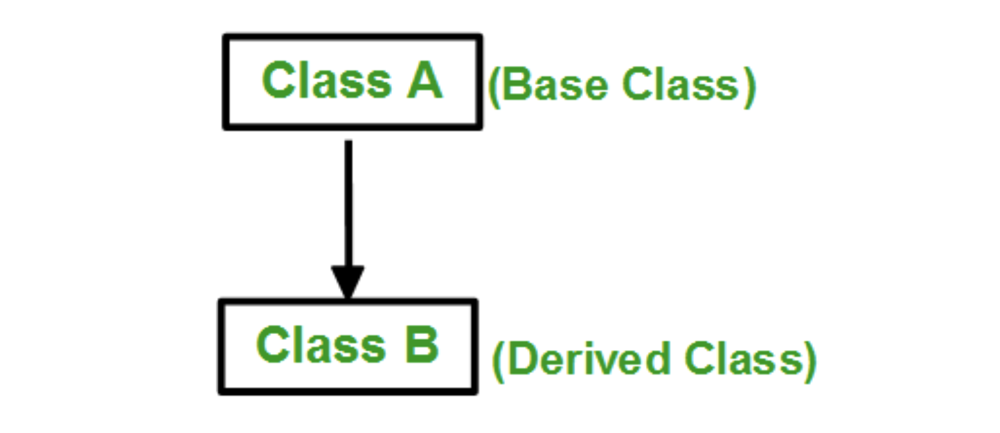
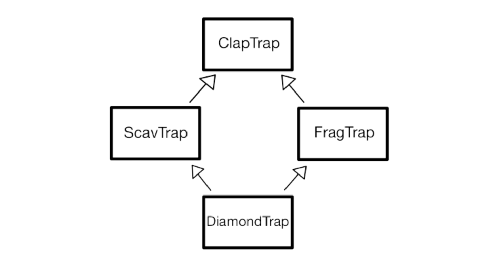

# Module 03

## Inheritance

In Object Oriented Programming (OOP) , inheritance refers to the ability to derive properties and characteristics from other classes as a way to establish relationships between objects.
    -Sub Class: The class that inherits properties from another class is called Subclass or Derived Class.
    -Super Class: The class whose properties are inherited by a subclass is called Base Class or Superclass.

    - Class initialization on inheritance:
    
In both the base class and the derived class, the members of the corresponding class must be initialized through the constructor of the corresponding class. Therefore, both the constructor of the base class and the constructor of the derived class must be called during the object creation process of the derived class. The order of destruction of objects created on the stack is opposite to that of creation. Therefore, when the object of the derived class is destroyed, the destructor of the derived class is executed and then the destructor of the base class is executed. And if there is a memory space dynamically allocated in the constructor, it must be freed in the destructor.

    - Modes of Inheritance:

There are 3 modes of inheritance (access modifiers):
    -Public Mode: If we derive a subclass from a public base class. Then the public member of the base class will become public in the derived class and protected members of the base class will become protected in the derived class (the public members of the base class are accessible by the objects of the derived class as well as by the member functions of the derived class).

    -Protected Mode: If we derive a subclass from a Protected base class. Then both public members and protected members of the base class will become protected in the derived class.

    -Private Mode: If we derive a subclass from a Private base class. Then both public members and protected members of the base class will become Private in the derived class.

The private members in the base class cannot be directly accessed in the derived class, while protected members can be directly accessed.

    - Access Control and Inheritance:

    -A derived class inherits all base class methods with the following exceptions:
        -Constructors, destructors and copy constructors of the base class.
        -Overloaded operators of the base class.

    - Types of Inheritance:

    -Single Inheritance: In single inheritance, a class is allowed to inherit from only one class.

    - Multiple inheritance is when two or more classes are inherited at the same time. The method of multiple inheritance can be specified by separating the inherited class using a comma in the existing inheritance method.

    - Problems with multiple inheritance:

        - Several problems (ambiguity) can arise with multiple inheritance. The first is that a member of the same name exists in both base classes.you can solve the problem by specifying which class the member is defined in through the scoping operator (::).

        - The second is that the same class is indirectly inherited twice in the case of diamond inheritance:

        - The second problem can be solved through virtual inheritance. With virtual inheritance, when an object of a derived class is created, the members of the base class are created only once. That is, it prevents duplicate creation of members of the base class.
        In the diamond inheritance type, if two classes that virtually inherit the same class are inherited multiple times, the problem of duplicate inheritance can be solved.