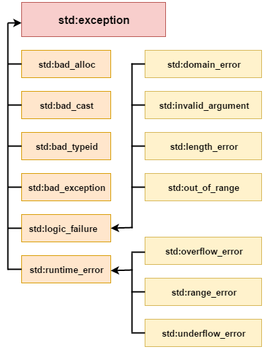

# Module 05

#  Exceptions:

In C++, exception handling is a method of dealing with runtime issues. We handle exceptions so the application’s usual flow may be maintained even when runtime issues occur.

In C++, an exception is an object thrown during the runtime process and disturbs the program’s normal execution.

The std::exception class is the root of all exceptions. If we don’t handle any exceptions, the application will print an error message and terminate.
Exceptions allow control to be passed from one program area to another. The three keywords try, catch, and throw handle exceptions in C++.

    - throw: If a segment in your code can cause a problem, then we throw an exception using the throw keyword and specify the type of exception that can occur.
    - try: It contains that code segment that can cause an error and needs to throw an exception.   
    - catch: the block called when an exception is thrown. In this block of code, we can inform the user about the error and end the program programmatically if required.

    -    Exception Class Hierarchy:
    

    -   Custom Exception:

Custom exceptions offer the exception handling mechanism with useful information about an issue. They may be created by either creating a new class with the necessary properties and throwing an instance of that class or by inheriting from std::exception and overriding the what() function.

    -   Nested Classes in C++:

A nested class is a class which is declared in another enclosing class. A nested class is a member and as such has the same access rights as any other member. The members of an enclosing class have no special access to members of a nested class; the usual access rules shall be obeyed.
#  Repetition: